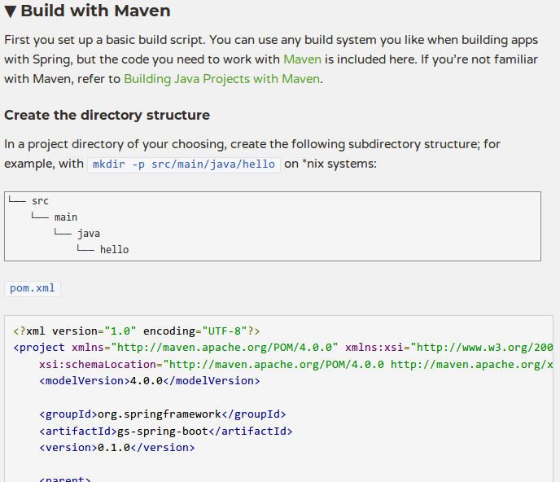

# Spring Boot
## PUZ Techworkshop 2018

<small>13.09.2018 - tran@puzzle.ch</small>

Note: Authentication, Encoding, Date and Timezone

<!-- .slide: class="master01" -->

---

## Infos

Workshop resources:

https://github.com/KeeTraxx/springboot-workshop-2018

---

## Agenda

1. Block 1: Vocabulary & Getting Started
2. Block 2: In-Depth Spring (JPA, Security)
3. Block 3: Where to go from here?

Note: 
Getting Started: Maven / Gradle, Spring Initialzr, Spring Actuators, Simple REST Controller

In-Depth Spring: Spring Batch, Testing, Integration Testing

Where to go from here: Reactive Spring, Websockets

<!-- .slide: class="master02" -->

---

## Demystifying Spring: Vocabulary

* Spring Framework
* Spring Boot
* Spring xxxx?

<!-- .slide: class="master01 intro" -->

---

### Spring Framework

Core ideas:

* Aspect Oriented Programming (AspectJ)
* Authentication & Authorization (Spring Security)
* Data Access (Spring Data)
* Inversion of Control: Dependency Injection (Spring DI)
* Model-View-Controller Pattern (Spring MVC)
* Unit & Integration Testing (Support classes)

---

### Spring Boot

Library to create standalone Spring applications.

Also a collection of "starter" packages with convention-over-configuration solution.

----

* spring-boot-starter-actuator
* spring-boot-starter-web
* spring-boot-starter-data-jpa
* spring-boot-starter-test

----

* spring-boot-starter-websocket
* spring-boot-starter-mail
* spring-boot-starter-hateoas
* spring-boot-starter-webflux

---

## Spring vs JEE?


https://www.slideshare.net/BenWilcock1/microservices-java-ee-vs-spring-boot-and-spring-cloud

----

Developers: 
> We just want to build, test and ship our application!

---

## Getting Started with Spring Boot

<!-- .slide: class="master02 intro" -->

---

## Manual Maven or Gradle build

https://spring.io/guides/gs/spring-boot/

## Spring Initialzr

https://start.spring.io/

---

## Manual Maven or Gradle build

Go through the tutorial at

https://spring.io/guides/gs/spring-boot/

 <!-- .element style="max-width: 40%;" -->

---

## Spring Intialzr

https://start.spring.io/

Prepares a Maven or Gradle project with all dependencies.

 <!-- .element style="max-width: 40%;" -->

---

## Why Spring Intialzr

* You can bootstrap new versions (opposed to copy/paste from an old or a seed project)
* Dependencies are usually handled well (opposed to copying dependency snippets from SO or similar)
* ==> Saves you time!

---

## Our first Spring Boot Application

* Select `DevTools`, `Web`, `Actuator`, `JPA` dependencies
* `unzip myapp.zip`
* 1st terminal: `./gradlew build --continuous`
* 2nd terminal: `./gradlew bootRun`

---

## Static web resources

Create `src/resources/static/index.html`

Open `http://localhost:8080/`

---

## Our first REST Controller

Create

`src/main/java/.../controller/MembersController.java`

```
@RestController
@RequestMapping("/api/members")
public class MembersController {
    @GetMapping
    public List<String> getMembers() {
        return Arrays.asList("Hanne", "Lure");
    }
}
```

Try it out:
http://localhost:8080/api/members

---

## Swagger UI (1)
Add to `build.gradle`

```
compile('io.springfox:springfox-swagger2:2.9.2')
compile('io.springfox:springfox-swagger-ui:2.9.2')
```

---

## Swagger UI (2)
Create `/src/main/java/.../configuration/SwaggerConfig.java`

```
@Configuration
@EnableSwagger2
public class SwaggerConfig extends WebMvcConfigurationSupport {
    @Bean
    public Docket apis() {
        return new Docket(DocumentationType.SWAGGER_2)
                .select().apis(RequestHandlerSelectors.any())
                .paths(PathSelectors.ant("/api/**"))
                .build();
    }

    @Override
    protected void addResourceHandlers(ResourceHandlerRegistry registry) {
        registry.addResourceHandler("swagger-ui.html")
                .addResourceLocations("classpath:/META-INF/resources/");

        registry.addResourceHandler("/webjars/**")
                .addResourceLocations("classpath:/META-INF/resources/webjars/");
    }
}
```

---

## Actuators

https://docs.spring.io/spring-boot/docs/current/reference/htmlsingle/#production-ready-endpoints

----

* [actuator/health](http://localhost:8080/actuator/health)
* [actuator/auditevents](http://localhost:8080/actuator/auditevents)
* [actuator/beans](http://localhost:8080/actuator/beans)
* [actuator/configprops](http://localhost:8080/actuator/configprops)
* [actuator/env](http://localhost:8080/actuator/env)
* [actuator/httptrace](http://localhost:8080/actuator/httptrace)

----

* [actuator/info](http://localhost:8080/actuator/info)
* [actuator/loggers](http://localhost:8080/actuator/loggers)
* [actuator/metrics](http://localhost:8080/actuator/metrics)
* [actuator/mappings](http://localhost:8080/actuator/mappings)
* [actuator/scheduledtasks](http://localhost:8080/actuator/scheduledtasks)
* [actuator/sessions](http://localhost:8080/actuator/sessions)

---

### Discussion


<!-- .slide: class="master04" -->
