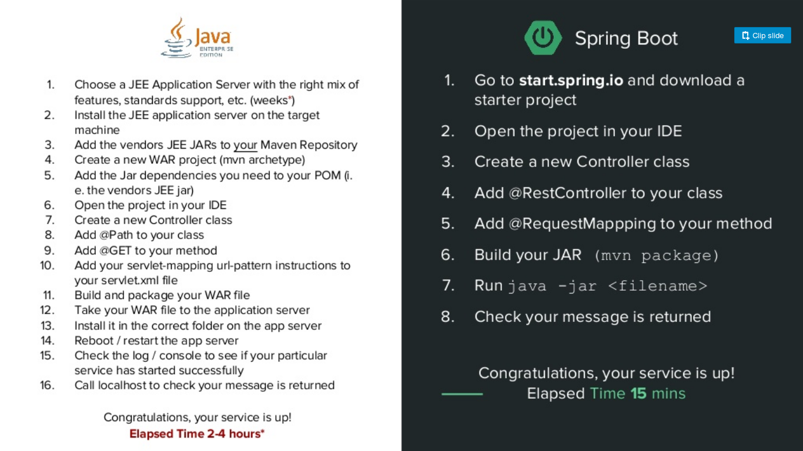

# Spring Framework

## PUZ Techworkshop 2018

<small>13.09.2018 - tran@puzzle.ch</small>

<!-- .slide: class="master01" -->

---

## Workshop resources

https://github.com/KeeTraxx/springboot-workshop-2018

## WIFI

SSID: InnoSpace
PW: InnoGuest31

Notes:

Has links to slides and example app.

Interrupt me and ask questions!

---

## Member introduction

Your know-how about Java, Spring / Spring Boot?

---

## Agenda

### Block 1 (10:25 - 12:00)

* What's Spring Framework & Getting Started
* Exercise
* js: Spring Security + Spring Security ACL

<!-- .slide: class="master01" -->

----

### Block 2 (13:35 - 15:00)

* Introduction Spring Data JPA
* Exercise

<!-- .slide: class="master02" -->

----

### Block 3 (15:20 - 16:40)

* Spring Boot Testing
* Exchange
* Where to go from here?

Note:

Some notes?

<!-- .slide: class="master03" -->

---

## What's Spring Framework?

Wikipedia:

> The Spring Framework is an application framework [...] for the Java platform.

---

## What's equivalent to the Spring Framework?

### Java

* JEE (formerly J2EE) + jax-rs + other stuffs
* Dropwizard
* Spark
* Grails (based on Spring Boot now)

----

### Scala

* Play Framework

----

### Ruby

* Ruby on Rails

----

### nodejs

* Express
* Loopback

----

### Python

* Django

----

### PHP

* Laravel
* Symfony

---

## Spring Ecosystem

Note:

Spring Batch

---

### Spring Boot

Library to create **standalone Spring applications**.

Also a collection of **"starter" packages** to simplify application configuration, using conventation over configuration.

---

## Spring Boot @round Puzzle

* BLS-POC
* HAST-OPR
* HAST-REG
* BLS-FMSX
* BLS-BAU
* SBB-ZLD
* SBB-TMS (TMS-L, FLUX)
* SBB-WFT
* ...

Note:

HAST-OPR: Spaltlampenregistrierung
HAST-REG: Produkteregistrierung
BLS-FMSX: Flottenmanager (neu)
BLS-BAU: Baustellen Tool
SBB-ZLD: Zuglenkung
SBB-TMS: Fahrplanoptimierung
SBB-WFT: Wartefristentool

---

## Why Spring Boot? (1)

---

## Why Spring Boot? (2)

### Advantages for developers

* Easy to connect a debugger
* Easier to write unit / integration tests
* Easier to debug unit / integration tests
* Helps you with mocking and isolation of tests
* Deploy as .jar and .war
* Less problems with dependencies

Note:

Show IDEA debug main

---

## Why Spring Boot? (3)

### Advantages for operators

* No need to choose, configure, operate application servers.
* Less problems with dependencies
* Less compatibility problems

---

Next up:

Exercise to flex your muscles!

