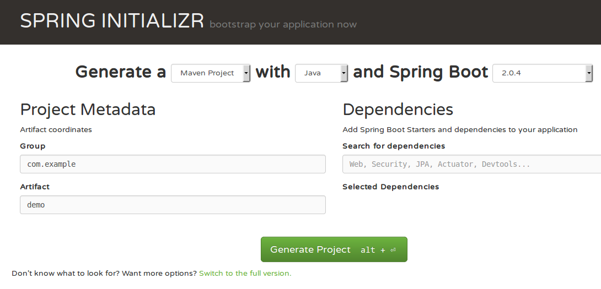

# Block 1: Exercise

<!-- .slide: class="master01" -->

---

## Goals:

1. Use [Spring Initialzr](https://start.spring.io/) to generate a project
2. Static web resources
3. Spring externalized configuration
4. First basic `@RestController`
5. Bonus: Deploy to Openshift
6. Bonus: Get to know Spring Actuators
7. Bonus: Advanced `@RestController`
8. Bonus: Throwing Exceptions in `@RestController`

---

## Step 1: Spring Intialzr (1)

https://start.spring.io/

Prepares a Maven or Gradle project with all dependencies.

 <!-- .element style="max-width: 40%;" -->

Note:

Advantages

* Recent version of Spring Boot
* Dependencies are likely to work together

---

## Step 1: Spring Intialzr (2)

* Select `DevTools`, `Web`, `Actuator`, `JPA` dependencies
* Generate Project
* `unzip myapp.zip`
* Run the project using your IDE or `./gradlew bootRun`

---

## Step 2: Static web resources

`echo "hello world" > src/resources/static/index.html`

Open `http://localhost:8080/` in your browser.

---

## Step 3: Spring externalized configuration

Create the file `src/main/resources/application.properties`

Contents:
```
my.custom.app.message=Hello World
```

----

Order (simplified):

1. Command line arguments (`java -jar myapp.jar --app.message=bonjour`)
2. JSON Configuration in SPRING_APPLICATION_JSON
3. Java System Properties (from `System.getProperties()` and `System.setProperty(...)`)
4. OS Environment variables (`APP_MESSAGE=bonjour`)
5. Profile specific outside jar (`application-{profile}.properties / .yml`)
6. Profile specific inside jar (`application-{profile}.properties / .yml`)
7. Main app configuration file (`application.properties / .yml`)

----

More details:

https://docs.spring.io/spring-boot/docs/current/reference/html/boot-features-external-config.html#boot-features-external-config

---

### Step 4: Rest Controller Example

Create the file `src/main/java/.../controllers/HelloController.java`

```
@RestController
@RequestMapping("/api/hello")
public class HelloController {

  @Value("${my.custom.app.message:No message defined}")
  private String message;

  @GetMapping
  public String sayHello() {
      return message;
  }
}
```
----

1. Restart your application
2. Check if [localhost:8080/api/hello](http://localhost:8080/api/hello) returns your value

---

## Step 5: Deploy to Openshift

* Login with Puzzle Account: `oc login https://techlab.openshift.ch`
* Create a project `oc new-project techworkshop-<YOUR_INITIALS>`
* Create a new app `oc new-app --name=web keetraxx/s2i-gradle-springboot~.`
* Create a route `oc expose svc/web`
* Start a build `oc start-build web --follow --from-dir=.`

---

## Step 6: Activate Actuators

In

`src/main/resources/application.properties`

add the following line:

```text
# Don't do this in production without security
management.endpoints.web.exposure.include=*
```

[Read more...](https://docs.spring.io/spring-boot/docs/current/reference/htmlsingle/#production-ready-endpoints)

----

* [actuator/health](http://localhost:8080/actuator/health)
* [actuator/auditevents](http://localhost:8080/actuator/auditevents)
* [actuator/beans](http://localhost:8080/actuator/beans)
* [actuator/configprops](http://localhost:8080/actuator/configprops)
* [actuator/env](http://localhost:8080/actuator/env)
* [actuator/httptrace](http://localhost:8080/actuator/httptrace)

----

* [actuator/info](http://localhost:8080/actuator/info)
* [actuator/loggers](http://localhost:8080/actuator/loggers)
* [actuator/metrics](http://localhost:8080/actuator/metrics)
* [actuator/mappings](http://localhost:8080/actuator/mappings)
* [actuator/scheduledtasks](http://localhost:8080/actuator/scheduledtasks)
* [actuator/sessions](http://localhost:8080/actuator/sessions)

---

## Step 7: Advanced `@RestController` stuff

Return lists:

```java
private final List<String> heroes = Lists.newArrayList("Batman", "Catwoman");

// Returns JSON Array of heroes
@GetMapping
public List<String> getHeroes() {
  return heroes;
}
```

----

Path Variables:

```java
@GetMapping("{letter}")
public Stream<String> getHeroesStartingWithLetter(@PathVariable String letter) {
    return heroes.stream().filter( name -> name.startsWith(letter));
}
```

URL: /heroes/b

----

HTTP GET Variables:

```java
@GetMapping
public Stream<String> getHeroesStartingWithLetter(@RequestParam String letter) {
    return heroes.stream().filter( name -> name.startsWith(letter));
}
```

URL: /heroes?letter=b

---

## Step 8: Throw Exceptions in `@RestController`

Annotate an `Exception` class

```java
@ResponseStatus(HttpStatus.NOT_FOUND)
public class NotFoundException() extends Exception {
    public NotFoundException(String s) {
      super(s);
  }
}
```

----

And then just throw it.

```java
@GetMapping("throw-a-404")
public void throwStuff() {
  throw new NotFoundException("Too lazy to look for anything.");
}

```

---

### Discussion


<!-- .slide: class="master04" -->
